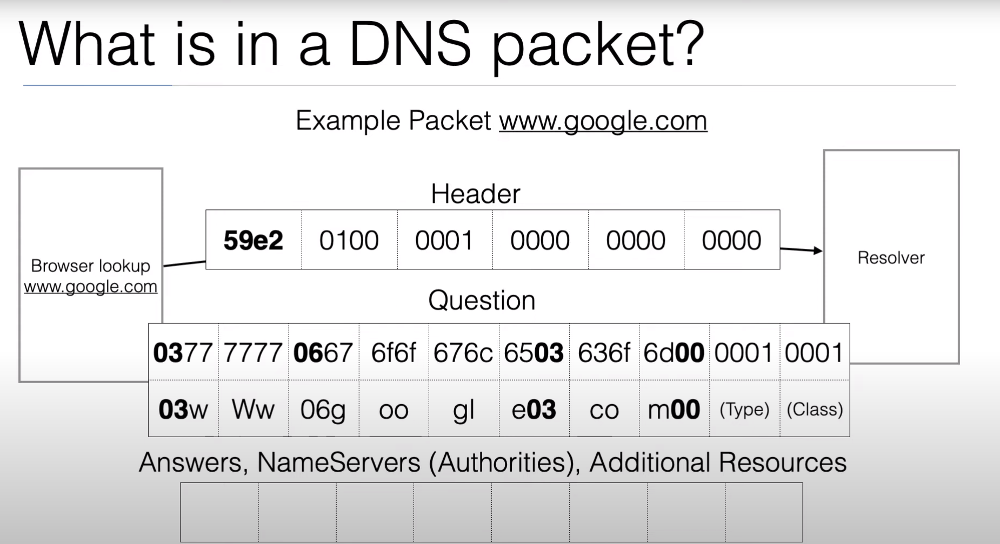
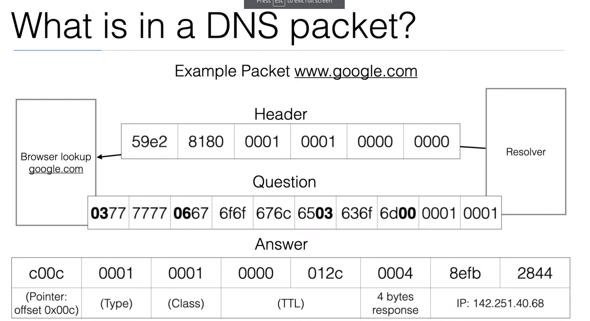
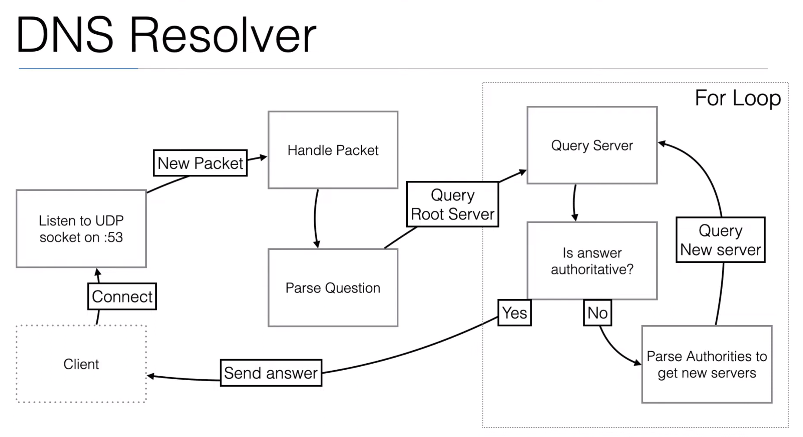
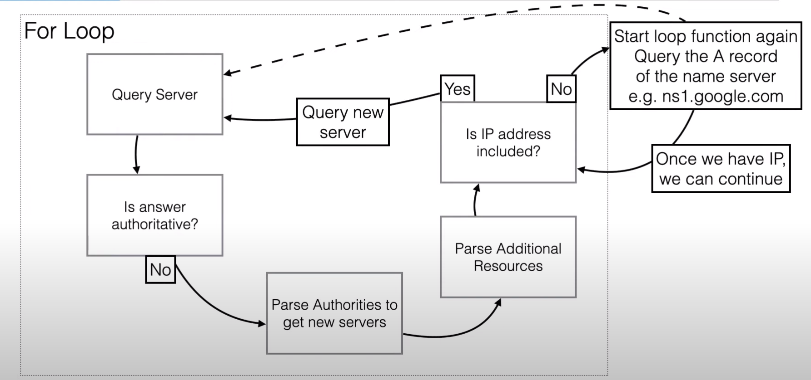
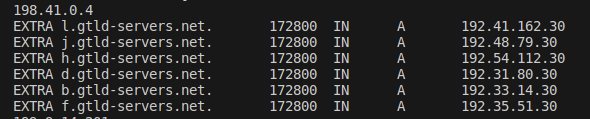

# go-dns-server

Gói tin question của DNS Message



Gói tin answer của DNS Message

Tương tự như gói tin question, nhưng có thêm body của phần answers, trong đó có bao gồm IP được phân giải



Ví dụ về việc sử dụng dig mặc định

```
vinh@vinhbh:~/Documents$ dig +trace google.com

; <<>> DiG 9.18.18-0ubuntu2.1-Ubuntu <<>> +trace google.com
;; global options: +cmd
.			84310	IN	NS	k.root-servers.net.
.			84310	IN	NS	c.root-servers.net.
.			84310	IN	NS	e.root-servers.net.
.			84310	IN	NS	l.root-servers.net.
.			84310	IN	NS	g.root-servers.net.
.			84310	IN	NS	m.root-servers.net.
.			84310	IN	NS	j.root-servers.net.
.			84310	IN	NS	d.root-servers.net.
.			84310	IN	NS	i.root-servers.net.
.			84310	IN	NS	a.root-servers.net.
.			84310	IN	NS	h.root-servers.net.
.			84310	IN	NS	b.root-servers.net.
.			84310	IN	NS	f.root-servers.net.
;; Received 239 bytes from 127.0.0.53#53(127.0.0.53) in 23 ms

com.			172800	IN	NS	i.gtld-servers.net.
com.			172800	IN	NS	e.gtld-servers.net.
com.			172800	IN	NS	a.gtld-servers.net.
com.			172800	IN	NS	d.gtld-servers.net.
com.			172800	IN	NS	j.gtld-servers.net.
com.			172800	IN	NS	f.gtld-servers.net.
com.			172800	IN	NS	g.gtld-servers.net.
com.			172800	IN	NS	k.gtld-servers.net.
com.			172800	IN	NS	c.gtld-servers.net.
com.			172800	IN	NS	b.gtld-servers.net.
com.			172800	IN	NS	h.gtld-servers.net.
com.			172800	IN	NS	l.gtld-servers.net.
com.			172800	IN	NS	m.gtld-servers.net.
com.			86400	IN	DS	19718 13 2 8ACBB0CD28F41250A80A491389424D341522D946B0DA0C0291F2D3D7 71D7805A
com.			86400	IN	RRSIG	DS 8 1 86400 20240714050000 20240701040000 20038 . s37zEwBeSxbi+cbkLo9A2WGAN7I8sJJyqITe6ROwW6VI26DSJ61zZXEE RWkzIAjfmk0GAmTC8wDchOp3vMP+Vzvdq3dP9egWgt/cZt3LkWw1PSaG ZMPAnOdlsZHhP14UuLaBHlssLey1bDKEkr268YkbRxsIc32Vwb1vjRw+ 7RGeDzQmNZa93hI2XuTpYLZ5Vexzzhh1NX3odwjHtShVr7Kccp/fNTqt geTvG3ejkd2hDmnIuVrSFMG9D4QBzv9820bibuON8B6Abaaq7/0nigvr iIlevArhUfedVwSK7rl5FPFGzeJ/xm1xcX0rXEHbBRD/ZuKcUNJjgAlZ n11KrQ==
;; Received 1170 bytes from 192.5.5.241#53(f.root-servers.net) in 39 ms

google.com.		172800	IN	NS	ns2.google.com.
google.com.		172800	IN	NS	ns1.google.com.
google.com.		172800	IN	NS	ns3.google.com.
google.com.		172800	IN	NS	ns4.google.com.
CK0POJMG874LJREF7EFN8430QVIT8BSM.com. 86400 IN NSEC3 1 1 0 - CK0Q2D6NI4I7EQH8NA30NS61O48UL8G5 NS SOA RRSIG DNSKEY NSEC3PARAM
CK0POJMG874LJREF7EFN8430QVIT8BSM.com. 86400 IN RRSIG NSEC3 13 2 86400 20240707002457 20240629231457 956 com. fUqDTwkfdL3McvJaDUQI8nJAOwYVk7quI5jYU4rLvVQofgJEZ7GJjNZL 7BY4hkQh/xmIjp1M5Ec+n5vVLxAt7A==
S84BOR4DK28HNHPLC218O483VOOOD5D8.com. 86400 IN NSEC3 1 1 0 - S84BR9CIB2A20L3ETR1M2415ENPP99L8 NS DS RRSIG
S84BOR4DK28HNHPLC218O483VOOOD5D8.com. 86400 IN RRSIG NSEC3 13 2 86400 20240708015347 20240701004347 956 com. Y5aDpmwhd2V1xAZ0m2K3uDzlg+4TNqvY/CkoT7NWHe5Y9UzqvUPSTi5f 9a8PMbfKYxTtNEc2TE5GG8f32C2+Jw==
;; Received 644 bytes from 192.5.6.30#53(a.gtld-servers.net) in 83 ms

google.com.		300	IN	A	172.217.25.14
;; Received 55 bytes from 216.239.34.10#53(ns2.google.com) in 39 ms

```


## Build DNS Server recursive resolver bắt đầu từ Root Server

[Src code](./dns-server/dns-server.go)

Sử dụng luồng logic sau:



Logic cụ thể trong phần đệ quy



1. Server query được khởi tạo bằng danh sách các root servers (bắt đầu từ root servers)
2. Bắt đầu query server với danh sách các IP
3. Nếu server có đủ thẩm quyền (authoritative) thì sẽ có response.Answer, và trong response.Answer sẽ có IP được phân giải (kết quả)
4. Nếu server không đủ thẩm quyền (isn't authoritative) tiến hành parse response để lấy các nameserver, sau đó tiến hành vào response.Extra (phần Additional của response), xảy ra 01 trong 02 kịch bản sau
5. a. Nếu extras (additionals) có Resource Record type A, thì tức là có IP bên trong, duyệt để lấy tất cả IP này và thực hiện lại bước 2


5. b. Nếu extras (additionals) không có IP, bắt đầu lặp lại query root server nhưng với body có name là tên nameserver vừa phân giải được (ví dụ ns1.google.com chứ không còn là name của client)


## References:
[Youtube - Write a DNS Server (Resolver)](https://www.youtube.com/watch?v=V3EAssIsQNI&t=6222s&ab_channel=EdwardViaene)